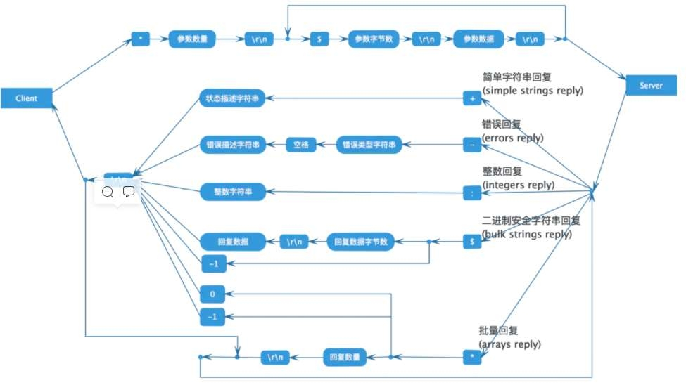

## *golang实现简单的redis-cli*
---------------------------------------

1、主要使用Redis的协议格式，实现简单的redis-cli.exe客户端功能，方便学习和理解redis。
- main.go tcp连接和终端cmd输入输出
- setting.go 命令行参数
- redis.go   encode和decode redis交互协议的数据

2、redis 协议的格式(\r\n分割)
- 1.间隔符号，在Linux下是\r\n，在Windows下是\n
- 2.简单字符串 Simple Strings, 以 "+"加号 开头
- 3.错误 Errors, 以"-"减号 开头
- 4.整数型 Integer， 以 ":" 冒号开头
- 5.大字符串类型 Bulk Strings, 以 "$"美元符号开头，长度限制512M
- 6.数组类型 Arrays，以 "*"星号开头

3、启动测试
 -  go build
 - redis-cli.exe -h 127.0.0.1 -p 6379
 